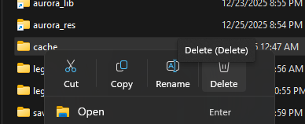
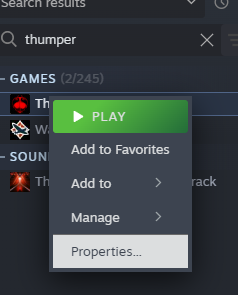

# Windows Install Guide
Before we can install Aurora. We need to make sure Java 25 or newer is installed. Open `cmd` and run `java --version`. Here's the results of the command below:

```
'java' is not recognized as an internal or external command,
operable program or batch file.
```

If this is the case then Java is not installed in the system path at all. Simply proceed to the `Installing Java` section.

```
java 25.0.1 2025-10-21 LTS
Java(TM) SE Runtime Environment (build 25.0.1+8-LTS-27)
Java HotSpot(TM) 64-Bit Server VM (build 25.0.1+8-LTS-27, mixed mode, sharing)
```
If you see something like this then you hava Java installed. In the example you see `25.0.1`. This version is okay! If you have a version older than `25` then proceed to the `Installing Java` section.

## Installing Java
You can visit the [Oracle website](https://www.oracle.com/java/technologies/downloads) to find the download links. If you're unsure which download to pick, then use this one: [Windows x64 MSI Installer](https://download.oracle.com/java/25/latest/jdk-25_windows-x64_bin.msi).

Simply proceed with the install. After installation launch `cmd` and run `java --version`. You should see this information:

```
java 25.0.1 2025-10-21 LTS
Java(TM) SE Runtime Environment (build 25.0.1+8-LTS-27)
Java HotSpot(TM) 64-Bit Server VM (build 25.0.1+8-LTS-27, mixed mode, sharing)
```

If this is the case then the installation of Java was successful and you may proceed. If this isn't the case then seek assistance in the Thumper Discord.

## Locate Thumper Working Directory
You want to do this via Steam. Open Steam and locate `Thumper` in your Steam Library. Right click `Thumper` and select `Manage` then `Browse Local Files`.


## Reset `cache`
Thumper's game data is located inside it's `cache` folder. Aurora expects a full base game install here. So we will delete the `cache` folder.



After this, in Steam select `Properties...` then `Installed Files` then `Verify integrety of game files`




## Downloading and Extracting Aurora
Aurora can be downloaded [here](https://github.com/anthofoxo/aurora/releases). There are pre-releases and stable builds. You'll likely be fine with a pre-release build but note that they are technically unstable. If you want to be on the safe side then grab the latest stable build.

You are presented 3 options when downloading:
* Aurora.xxx.zip
* Source code (zip)
* Source code (tar.gz) 

You want the `Aurora.xxx.zip`. Do not download the source code packaged unless you plan on assisting in developing the tools.

## Create `steam_api64.dll.bak`
Once this folder opens you must create a backup file. in the folder you will see `steam_api64.dll`. You want to copy and paste this file. This copy should be named `steam_api64.dll.bak`. You'll be warned about changing the file extension; confirm this change.

<video controls src="../20260111-0531-37.0184976.mp4" title="Creating steam_api64.dll.bak"></video>

## Extracting Aurora
In this same folder. This is where you will extract your downloaded `.zip` file. The zip file will contain two files: `steam_api64.dll` and `Aurora xxx.jar` you will extract this zip file into the folder opened by Steam. Do not extract the `.jar` file. Confirm the overwrite for `steam_api64.dll`.

<video controls src="../20260111-0534-28.1631572.mp4" title="Extracting Aurora.zip"></video>


## Verify
At this point Aurora should be installed and ready to go. Launch Thumper and the Aurora window should appear.

<video controls src="../20260111-0542-05.6685548.mp4" title="Launching Thumper with Aurora"></video>
