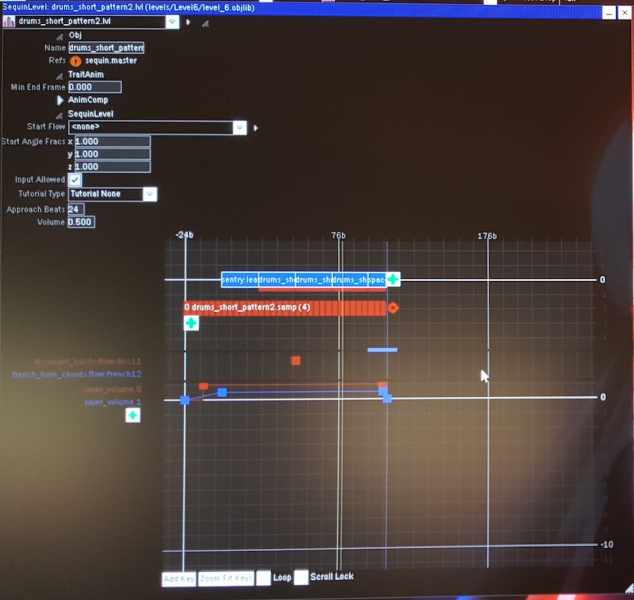

# Structure of Level .objlib Files
Level .objlib files are some of the largest .objlib files, each containing hundreds of objects. The purpose of this type of .objlib files is to define what visual and audio elements appear in an entire level, and at what time these elements appear.

## Object Hierarchy
The majority of objects in a level .objlib file are used to sequence the things and events happening in a level. These objects follow a hierarchical structure.

### Master
A .master Object is the sequence master of a level .objlib file, defining the order of all .lvl Objects and .gate Objects within that file. Each level .objlib file has exactly one .master Object.

A screenshot of Drool's Editor with a .master Object open is shown below.

### Level
For level .objlib files, a .lvl Object roughly corresponds to a regular (non-boss) sub-level in the game. In some cases, a .lvl Object is part of a regular sub-level or boss section. Each .lvl Object is made up of one or more patterns called ".leaf Objects". Sample loops with volume envelopes and one-off SFX can be defined in a .lvl Object.

Here is a screenshot of Drool's Editor showing the .lvl Object named drums_short_pattern2.lvl, from levels/Level6/level_6.objlib.

### Gate
A .gate Object represents a boss sub-level in the game. Each .gate Object is made up of one or more boss patterns, each represented by a separate .lvl Object.

### Leafs
For level .objlib files, a .leaf Object (or SequinLeaf Object) represents a short pattern within a sub-level in the game. Each .leaf Object contains multiple Sequencer Objects that change the parameter values of different objects, including the .leaf Object itself, over the course of the pattern. The Sequencer Objects collectively define the events occurring during the pattern, such as the twisting and turning of the track, at what time thumps, red bars, blue rings, jumps and decorative objects appear on or around the track, the color changes of the skybox and post effects, at what time one-off samples are played, etc.

The following screenshot shows a modified version of the .leaf Object named drums_short_pattern2.leaf, from levels/Level6/level_6.objlib.

